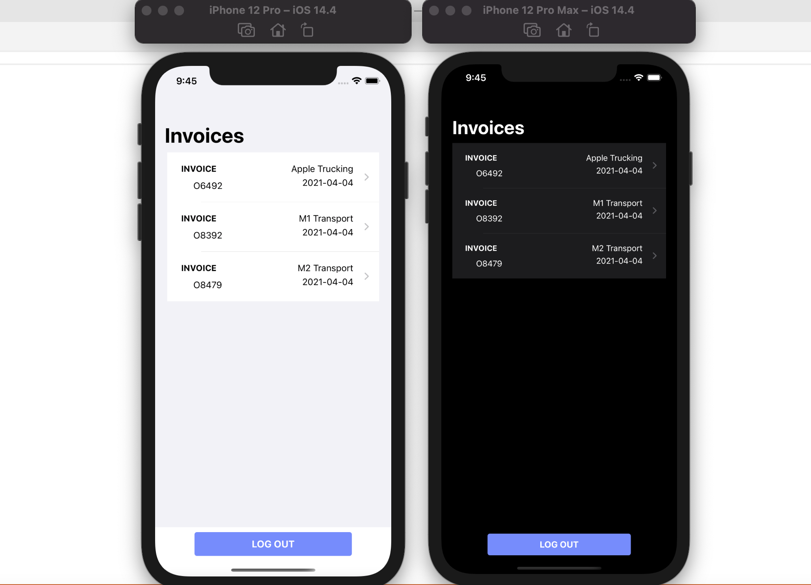

# Invoice Approval App

I built this app to learn about SwiftUI and it's is inspired by the [Synergize MobileWorkflo‪w](https://apps.apple.com/ca/app/synergize-mobileworkflow/id1115310164) application available in the [AppStore](https://apps.apple.com)

## iOS App

- Review [client/iOS/Readme.md](client/iOS/Readme.md)
- 

## Server - web API

- Review [server/invoice-approval-api/Readme.md](server/invoice-approval-api/Readme.md)
