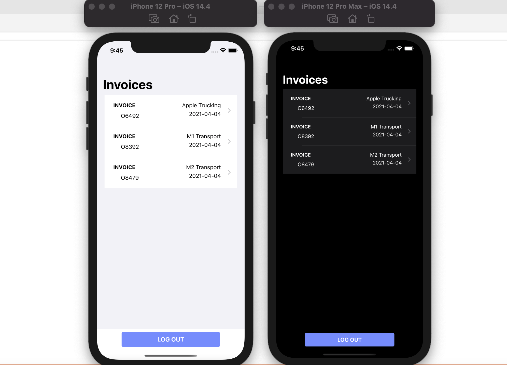
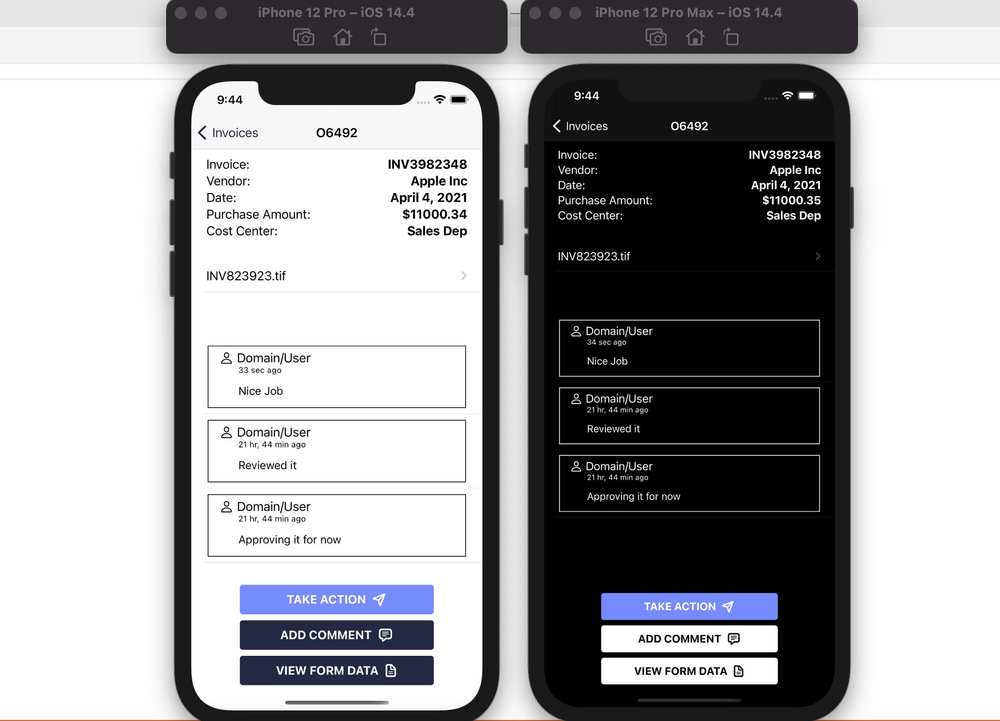
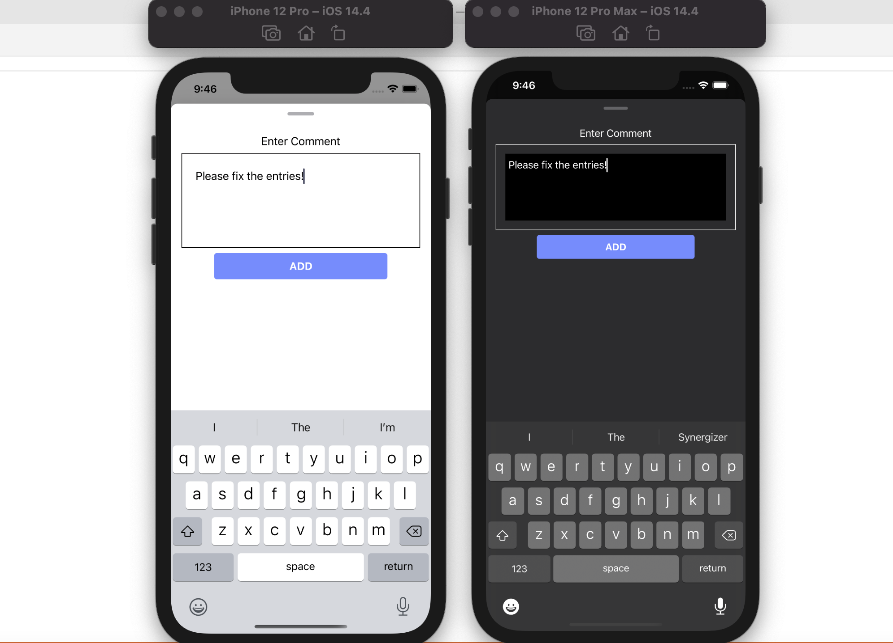

# Invoice Approval - iOS App

- List View 
- Invoice Detail View 
- Invoice - Add comment 

## Required Tools

- [Xcode 12](https://developer.apple.com/xcode/)

## Getting Started

- `open InvoiceApproval.xcodeproj` - Launch current project in Xcode
